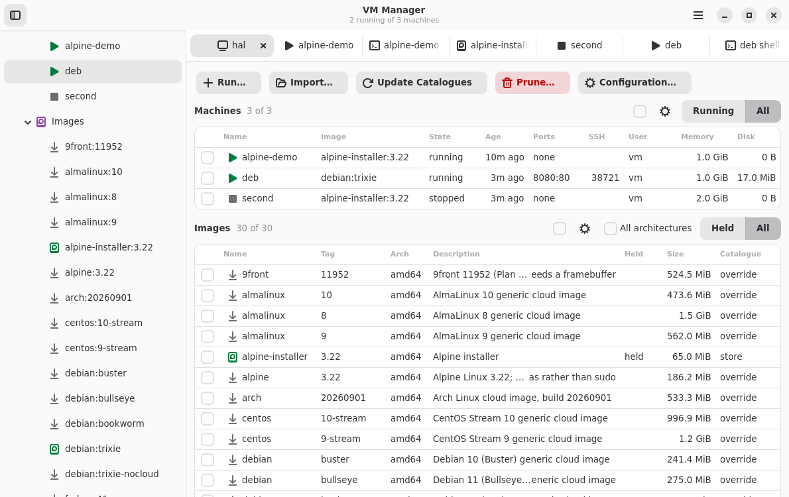

# VM Manager

Create and manage QEMU virtual machines from prebuilt OS images, with a command
set modelled on Docker and various cloud clients.

The `vm` command:


`vmg` or `vm gui` lets you do all the same things with a desktop GUI:



## Building and running

Build prerequisites (Debian 13):

```bash
sudo apt install build-essential
```

You also need Rust (2024 edition) from [Rustup.sh](https://rustup.rs/) or elsewhere.

Then:

```bash
cargo build
cargo run -p vm -- images
```

## Commands

| Command | Purpose |
|---|---|
| `vm images` | List the images the catalogues name; `--local`, `--remote` or `--catalogue` narrows it |
| `vm inspect <name or image>` | Show a machine's settings, or an image's details, origin and users; `--type` chooses, `--arch` picks a build |
| `vm pull <image>` | Fetch an image into the local store |
| `vm import <source> <image>` | Bring an image file or URL into the local store |
| `vm export <image> <file>` | Copy an image from the local store to a file |
| `vm update [catalogue]` | Refresh the remote catalogues, or one |
| `vm config` | Show the config file, or change a setting or catalogue |
| `vm run <image>` | Create and start a machine |
| `vm start <name>` | Start a stopped machine, optionally changing its settings; `--eject` removes its CD-ROM |
| `vm gui` | Open the window, `vmg` |
| `vm ssh <name>` | Open a shell on a machine, or run a command in it |
| `vm exec <name> -- <command>` | Run a command in a machine with its arguments, streams and exit status intact |
| `vm cp <from> <to>` | Copy files, naming one side as `name:path` |
| `vm ps` | List machines; `--all` includes stopped ones, `--follow` refreshes, `-q` lists names only |
| `vm stop <name>...` | Ask the guests to shut down, then force them |
| `vm pause <name>...` | Stop machines' processors |
| `vm unpause <name>...` | Let paused machines carry on |
| `vm kill <name>...` | Stop machines without telling the guests |
| `vm logs <name>` | Show a machine's console output; `--follow` streams it, `--tail` shortens it |
| `vm console <name>` | Attach to a machine's serial console; Ctrl-] detaches |
| `vm screen <name>` | Open a VNC viewer on a machine's screen |
| `vm screenshot <name> [file]` | Save a machine's screen as a PNG |
| `vm clone <name> <image>` | Save a machine's disk as a new image; `-m` describes it |
| `vm rm <name>...` | Delete machines and their disks |
| `vm rmi <image>...` | Delete images from the local store |
| `vm prune` | Remove machines and images nothing needs; `--all` includes anything unused |

An image is named `repository:tag`, as in `debian:trixie`. The tag defaults to
`latest`. Appending `@sha512:...` pins the build: a reference whose digest does
not match the catalogue is refused.

`man vm` describes every command and option.

## Images

The catalogue ships with `debian`, `ubuntu`, `fedora`, `centos`, `almalinux`,
`rocky`, `opensuse`, `alpine`, `arch`, `kali`, `omnios`, `freebsd`, `netbsd`,
`9front` and `puredarwin`, several releases apiece. Each entry names a dated
build and its publisher's checksum, which `vm pull` verifies.

An entry may declare that its image is compressed (`compression`), the file in
a tar archive that is the image (`archive_member`), its `format`, a
`source_format` to convert to qcow2 when pulled, `media = "cdrom"` for a CD-ROM
image, and hardware it needs: `firmware`, `cpu_model`, `machine` and `disk`.

### Importing

`vm import` names a local file or an `http` or `https` URL as an image in the
`store` catalogue. The source may be compressed with xz, gzip or zstd, and may
be a tar archive holding one file. A disk image, such as vmdk, vdi, vhdx or
raw, is converted to qcow2; an ISO CD-ROM image is kept as it is.

```bash
vm import ./appliance.vmdk appliance:1.0
vm import https://example.com/os-installer.iso installer:1.0
```

An imported URL stays fetchable: `vm prune --all` may remove the file, and
`vm run` or `vm pull` fetches and converts it again. `--forget-url` keeps only
the local copy. `--login cloud-init` marks an image that takes a cloud-init
seed, `--firmware`, `--machine`, `--disk` and `--cpu-model` give hardware it needs,
`--digest` checks the source, and `--force` replaces an image of the same name.

### Exporting

`vm export` copies a pulled or local image to a file, in the format it is
stored in: qcow2 for imports and clones, ISO for CD-ROM images. A name without
an image suffix gains one, a directory gains a file named after the image, and
a suffix for another format is refused. `--compress` compresses the file with
xz, or with `gzip` or `zstd` if named, adding `.xz`, `.gz` or `.zst`. `--force`
replaces an existing file.

```bash
vm export appliance:1.0 ./appliance
vm export appliance:1.0 ./appliance --compress zstd
```

## Machines

`vm run` fetches the image if needed and starts a machine with its own
writable disk. `-p host:guest` forwards a port on 127.0.0.1, and
`-p address:host:guest` on another address; `-v /host/path:/guest/path` shares a
directory, read-only with a trailing `:ro`. `-m` sets memory, `--cpus`
processors, `--cpu-model` the QEMU CPU model, and `--name` the name. `--rm`
removes the machine once it stops.

Each machine gets its own key pair and an account named by `--user`, so `vm
ssh` needs no password. `vm ssh` wraps `ssh`, so `~/.ssh/config` and the agent
still apply. `--password` sets a password for console logins.

`--add-ssh-config` lets plain `ssh`, `scp` and `rsync` reach the machine by
name:

```bash
vm run debian:trixie --name mytestvm --add-ssh-config
ssh mytestvm
```

This adds one `Include` line to the top of `~/.ssh/config`. A name already used
by a `Host` there is refused. `vm rm` or `vm start --no-ssh-config` removes the
entry.

`vm exec` runs a command for scripts, as `docker exec` does: each argument
reaches the guest unchanged, standard input is forwarded only with `-i`, `-t`
gives a terminal, and it exits with the command's status, or 125 when `vm`
itself fails. It waits up to a minute for a starting machine:

```bash
vm run debian:trixie --name ci --rm
tar -c . | vm exec -i ci -- tar -x -C /srv
vm exec -w /srv ci -- make test
vm stop ci
```

`vm start` accepts the same settings as `vm run` and applies them from then on.
`--no-port`, `--no-volume` and `--no-password` clear them.

Images without cloud-init still run, but take no key and no account.

### CD-ROM images

A machine run from a CD-ROM image gets a blank disk, 20G unless `--disk-size`
says otherwise, and boots the CD-ROM until the disk holds a system. An
installer's reboot therefore starts the installed system. `vm start --eject`
removes the CD-ROM, after which the machine no longer needs the image, and
`vm clone` saves the installed disk as an image.

Machine state lives under `$XDG_STATE_HOME/vm/instances`.

### Pruning

`vm prune` removes what can never be used again: machines whose image is gone
for good, images no catalogue entry names, and files left by stopped machines
or unfinished downloads. `--all` also removes every stopped machine and every
pulled image no machine uses; machines go first, so their images go in the same
run. `vm prune machines` or `vm prune images` limits it to one kind, and
`--dry-run` lists without removing. Running and paused machines, images in use,
and images that cannot be fetched again are never removed.

### Ping

`ping` from a guest gets no replies unless the host allows unprivileged pings
for one of the user's groups. Check with
`cat /proc/sys/net/ipv4/ping_group_range`; if it reads `1 0`, run:

```bash
echo 'net.ipv4.ping_group_range = 0 2147483647' | sudo tee /etc/sysctl.d/60-ping.conf
sudo sysctl --system
```

Only echo requests pass, so `traceroute` and `mtr` see nothing past the host.

## The window

`vmg`, or `vm gui`, opens a window over the same machines and images. The
sidebar lists this host, its machines and the images it holds; the host tab
tables every image the catalogues name. Selecting one opens a tab of its
details and the actions its state allows.
Consoles, shells, logs and file copies open as terminal tabs. Every `vm`
command has a counterpart there; `man vmg` lists them.

Building it needs the GTK, libadwaita and VTE development packages:

```bash
sudo apt install pkg-config libgtk-4-dev libadwaita-1-dev libvte-2.91-gtk4-dev
```

The `vm-manager-gui` package installs it alongside `vm-manager`. It publishes a
panel indicator where the desktop shows one; GNOME needs
`gnome-shell-extension-appindicator`.

## Shell completion

The package installs completion for bash, zsh and fish, covering commands,
flags, machine names, image references and machine settings.

Without the package, with `vm` on the `PATH`, use one of:

```bash
source <(COMPLETE=bash vm)
source <(COMPLETE=zsh vm)
COMPLETE=fish vm | source
```

## Configuration

`$XDG_CONFIG_HOME/vm/config.toml` is optional. `vm config` shows where it is,
what it sets and what is defaulted, and changes it:

```bash
vm config set default_user '$USER'
vm config add remote internal https://mirror.example.com/vm/catalogue.toml --path images
vm config add local team /srv/vm/catalogue
vm config remove remote internal
```

Invalid values are refused, and no file is created until a change is made.
`man vm-config` describes the settings: the catalogues, whether `vm run`
fetches missing images, whether machines get an SSH config entry by default,
and `default_user`, the account created when `--user` is not given.
`default_user = "$USER"` uses the name of the user running `vm`.

Several catalogues can name images. Remote catalogues are fetched by
`vm update`; local ones are read in place. When two name the same image the
later one wins: remotes in the order listed, then locals in the order listed,
then `store`, the catalogue `vm clone` and `vm import` write to.

```toml
[[remote]]
name = "project"
url = "https://vm-manager.com/catalogue.toml"

[[remote]]
name = "internal"
url = "https://mirror.example.com/vm/catalogue.toml"
path = "images"

[[local]]
name = "team"
path = "/srv/vm/catalogue"
```

Without a `[[remote]]` the project's catalogue is the only remote.

A remote's `url` names a pointer file giving the catalogue's version and its
gzipped tar archive, as a URL or a file name beside the pointer. The archive
holds one top-level directory; `path` names the directory of entries within it,
default `catalogue`.

```toml
version = "0.0.1"
archive = "catalogue-0.0.1.tar.gz"
```

## Output

Commands write text by default, or `--format json` / `--format yaml` (or
`VM_FORMAT`). In those formats standard output holds only the document; errors
carry a stable `kind`.

## Licence

MIT.
